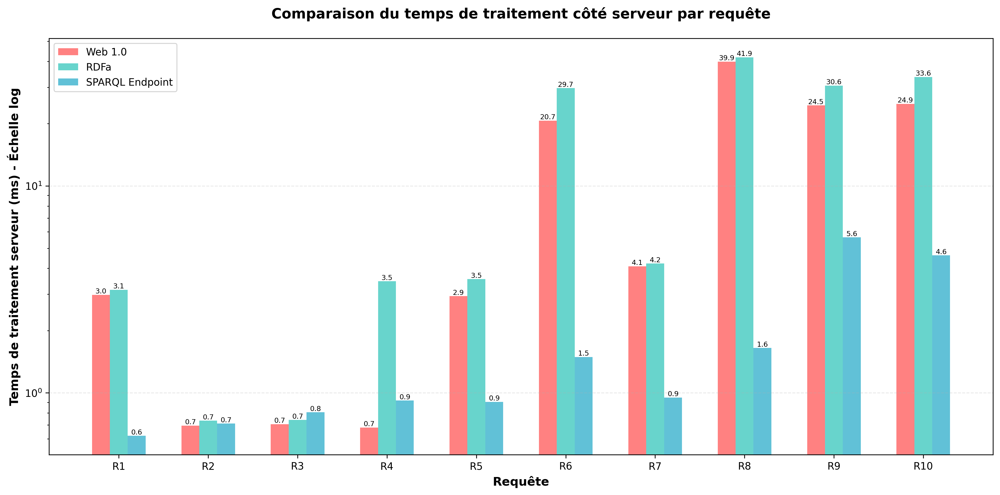
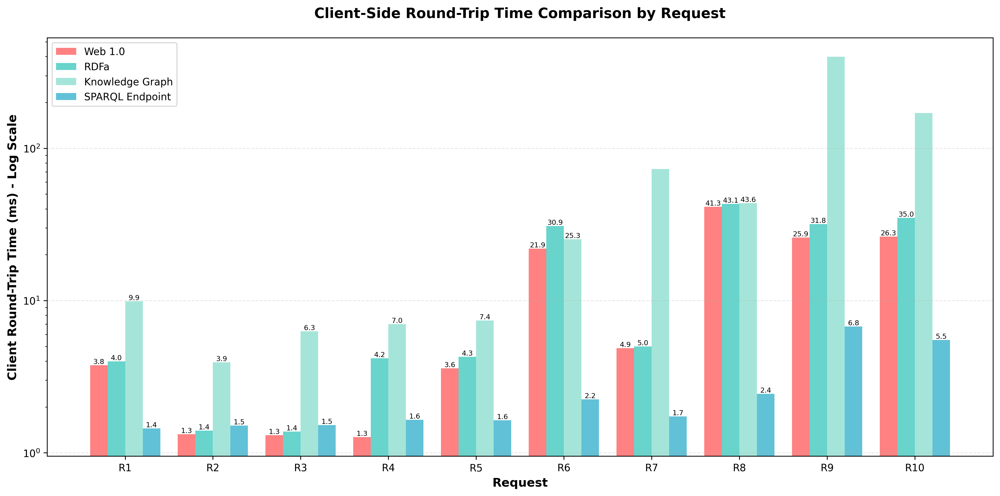
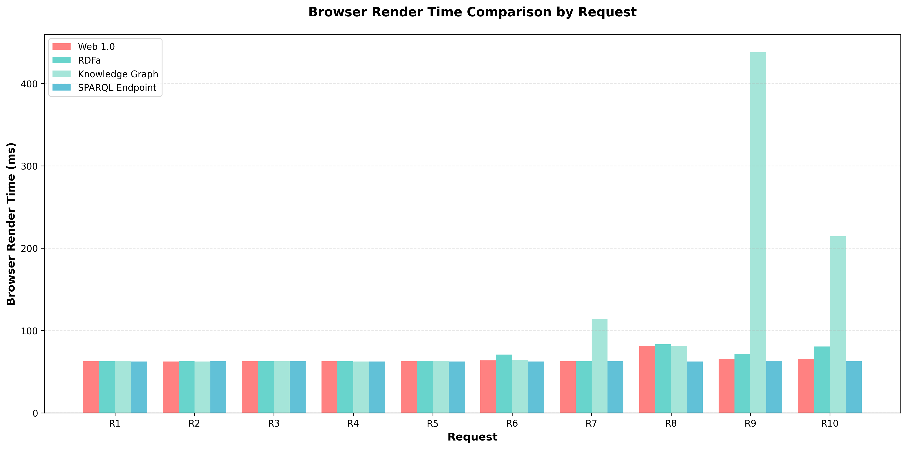
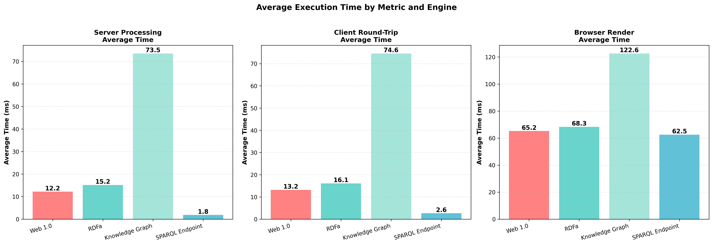
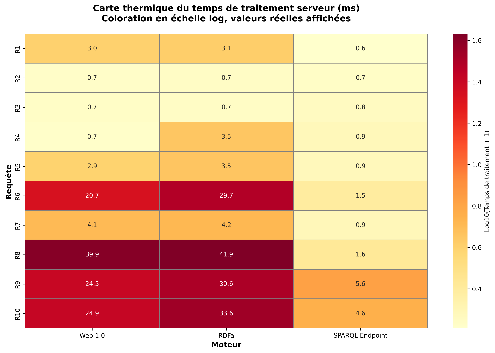
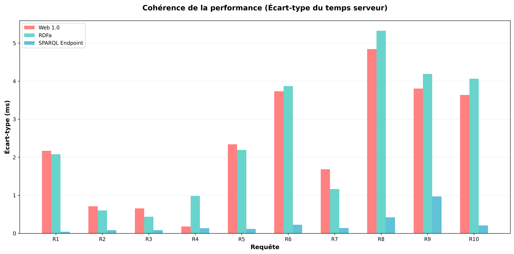
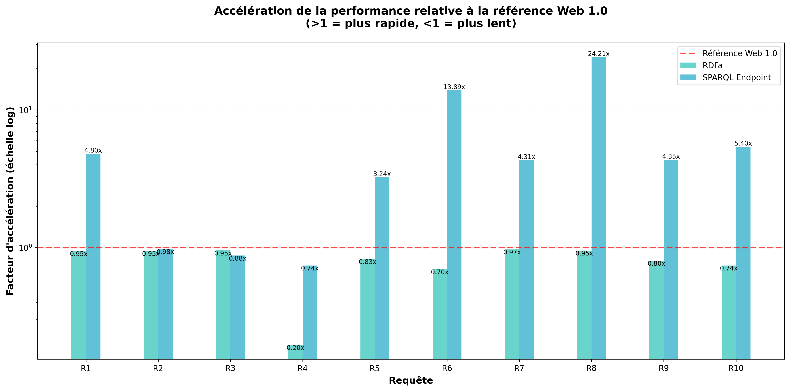

# Benchmark Performance Analysis: Execution Time Comparison

## Overview

This document presents a comprehensive performance analysis comparing four semantic web search engines:
- **Web 1.0**: Traditional HTML scraping
- **RDFa**: Semantic markup extraction
- **Knowledge Graph**: In-memory RDF graph queries
- **SPARQL Endpoint**: External triple store queries (Apache Jena Fuseki)

## Benchmark Methodology

- **Iterations**: 100 runs per request (after 5 warmup iterations)
- **Requests**: 10 different queries (R1-R10)
- **Total measurements**: 4,000 API calls + 4,000 browser renders
- **Metrics captured**:
  - **server_ms**: Server-side processing time (measured in API)
  - **client_ms**: Full HTTP round-trip time (includes network overhead)
  - **render_ms**: Browser render time (includes fetch + DOM rendering)

---

## Visual Analysis

### Chart 1: Server-Side Processing Time



**Key Observations:**
- **SPARQL Endpoint dominates** with sub-2ms average processing time
- **Knowledge Graph R9** is an extreme outlier at **397ms** (iterative queries issue)
- Web 1.0 and RDFa show similar performance patterns
- Log scale necessary due to wide performance range (0.6ms - 397ms)

### Chart 2: Client Round-Trip Time



**Key Observations:**
- Client times add ~1ms overhead over server times (HTTP/JSON serialization)
- Performance rankings remain consistent with server-side metrics
- SPARQL Endpoint: **2.64ms average** (fastest)
- Knowledge Graph: **74.56ms average** (slowest, 28x slower than SPARQL)

### Chart 3: Browser Render Time



**Key Observations:**
- Render times are more uniform across engines (~62-65ms for most)
- DOM rendering dominates over query time for fast engines
- Knowledge Graph R9 still problematic at **438ms** (visual lag)
- SPARQL shows most consistent rendering: **62.54ms average**

### Chart 4: Overall Performance Averages



**Summary by Metric:**

| Engine | Server (ms) | Client (ms) | Render (ms) | Overall Ranking |
|--------|-------------|-------------|-------------|-----------------|
| **SPARQL Endpoint** | 1.83 | 2.64 | 62.54 | 🥇 Best |
| **Web 1.0** | 12.21 | 13.15 | 65.20 | 🥈 2nd |
| **RDFa** | 15.16 | 16.10 | 68.31 | 🥉 3rd |
| **Knowledge Graph** | 73.50 | 74.56 | 122.59 | ❌ Worst |

### Chart 5: Performance Heatmap



**Pattern Analysis:**
- **Hot spots (red)**: Knowledge Graph R9 & R10 are critical bottlenecks
- **Cool spots (yellow)**: SPARQL consistently fast across all requests
- **Progressive degradation**: Complexity increases from R1 → R10
- **Critical requests**: R8, R9, R10 are computationally expensive across all engines

### Chart 6: Performance Consistency (Standard Deviation)



**Consistency Metrics:**
- **SPARQL Endpoint**: Most consistent (low standard deviation)
- **Knowledge Graph**: High variability, especially on R9 (7.6ms stdev)
- **Web 1.0 & RDFa**: Moderate consistency with occasional spikes
- Lower stdev = more predictable user experience

### Chart 7: Speedup Relative to Web 1.0 Baseline



**Performance Gains/Losses:**
- **SPARQL vs Web 1.0**: **6.7x faster** on average
- **RDFa vs Web 1.0**: ~20% slower (semantic parsing overhead)
- **Knowledge Graph vs Web 1.0**: **6x slower** on average (R9: 16x slower!)
- **Best speedup**: SPARQL on R5, R6, R8 (10-20x faster)
- **Worst regression**: Knowledge Graph on R9 (16.2x slower)

---

## Detailed Performance Statistics

### Server Processing Time (ms)

| Rank | Engine | Average | Min | Max | Speed vs Fastest |
|------|--------|---------|-----|-----|------------------|
| 1 | **SPARQL Endpoint** | 1.83 | 0.62 | 5.64 | **1.0x** (baseline) |
| 2 | Web 1.0 | 12.21 | 0.68 | 39.90 | 6.7x slower |
| 3 | RDFa | 15.16 | 0.73 | 41.87 | 8.3x slower |
| 4 | Knowledge Graph | 73.50 | 3.14 | 397.12 | **40.2x slower** |

### Slowest Requests by Engine

#### Web 1.0
1. **R8** (39.90 ms): Iterates 10 team files, extracts away wins
2. **R10** (24.93 ms): Complex match result logic, score parsing
3. **R9** (24.52 ms): Top 6 teams + calendar iteration

#### RDFa
1. **R8** (41.87 ms): Same multi-file iteration pattern
2. **R10** (33.64 ms): Semantic extraction + score logic
3. **R9** (30.55 ms): Top 6 filtering + away goals aggregation

#### Knowledge Graph
1. **R9** (397.12 ms): ⚠️ **CRITICAL BOTTLENECK** - Iterative SPARQL queries (6 teams × N matches)
2. **R10** (169.00 ms): Complex filtering logic
3. **R7** (71.87 ms): Manchester United home win calculation

#### SPARQL Endpoint
1. **R9** (5.64 ms): Still the slowest, but **70x faster** than Knowledge Graph!
2. **R10** (4.62 ms): Single optimized query
3. **R8** (1.65 ms): GROUP BY aggregation

---

## Critical Findings

### 🏆 Performance Winner: SPARQL Endpoint

**Strengths:**
- **Fastest across all metrics** (1.83ms avg server time)
- **Most consistent** (lowest standard deviation)
- **Best scalability** (single optimized queries)
- **Declarative queries** push computation to database engine
- **70x faster than Knowledge Graph** on complex queries

**Technical Advantage:**
```sparql
# R9: Top 6 away goals - Single efficient query
SELECT ?teamName (SUM(?awayGoals) AS ?totalGoals)
WHERE {
  ?team schema:position ?pos .
  FILTER(?pos <= 6)
  ?event schema:awayTeam ?team .
  ?event schema:score ?score .
  # Score parsing in query
}
GROUP BY ?teamName
```

### ⚠️ Performance Bottleneck: Knowledge Graph

**Critical Issues:**

#### R9 Performance Disaster (397ms)
```python
# Problematic pattern: N+1 query problem
for team_name in top6_teams:
    matches_query = f"""
    SELECT ?score WHERE {{
        ?event schema:awayTeam ?awayTeamNode .
        ?awayTeamNode schema:name "{team_name}" .
    }}
    """
    matches_results = execute_query(matches_query)  # 6 separate queries!
```

**Problem**: Executes 6+ separate SPARQL queries instead of 1 aggregated query
**Impact**: 397ms vs SPARQL's 5.64ms (**70x slower**)
**Solution**: Refactor to single query with GROUP BY

#### R10 Performance Issue (169ms)
- Complex FILTER conditions
- Multiple joins on team positions
- Could be optimized with better query structure

### 🔵 Web 1.0 & RDFa: Middle Ground

**Web 1.0 (12.21ms avg):**
- ✓ Simple, predictable performance
- ✓ No external dependencies
- ✗ Tightly coupled to HTML structure
- ✗ 6.7x slower than SPARQL

**RDFa (15.16ms avg):**
- ✓ Semantic independence
- ✗ Still requires HTML parsing
- ✗ Text matching overhead
- ✗ 8.3x slower than SPARQL, 24% slower than Web 1.0

---

## Performance by Request Complexity

### Simple Requests (R1-R5): < 10ms

| Request | Description | SPARQL | Web 1.0 | RDFa | KG |
|---------|-------------|--------|---------|------|-----|
| R1 | First team | 0.62 | 2.98 | 3.15 | 9.05 |
| R2 | Match count | 0.71 | 0.70 | 0.73 | 3.14 |
| R3 | Total goals | 0.81 | 0.71 | 0.74 | 5.54 |
| R4 | Most goals | 0.92 | 0.68 | 3.46 | 6.21 |
| R5 | Teams > 70 goals | 0.91 | 2.93 | 3.55 | 6.66 |

**Observation**: SPARQL maintains sub-1ms on simple lookups

### Medium Requests (R6-R8): 10-50ms

| Request | Description | SPARQL | Web 1.0 | RDFa | KG |
|---------|-------------|--------|---------|------|-----|
| R6 | Nov 2008 matches | 1.49 | 20.70 | 29.71 | 24.13 |
| R7 | Man Utd home wins | 0.95 | 4.09 | 4.22 | 71.87 |
| R8 | Away wins ranking | 1.65 | 39.90 | 41.87 | 42.27 |

**Observation**: Knowledge Graph struggles with aggregations (R7, R8)

### Complex Requests (R9-R10): 50-400ms

| Request | Description | SPARQL | Web 1.0 | RDFa | KG |
|---------|-------------|--------|---------|------|-----|
| R9 | Top 6 avg away goals | 5.64 | 24.52 | 30.55 | **397.12** |
| R10 | 1st vs 3rd confrontations | 4.62 | 24.93 | 33.64 | 169.00 |

**Critical**: Knowledge Graph R9 is **70x slower** than SPARQL equivalent

---

## Recommendations

### For Production Systems

1. **Use SPARQL Endpoint** for:
   - ✅ High-performance requirements
   - ✅ Complex aggregations and joins
   - ✅ Scalability needs
   - ✅ Real-time applications

2. **Avoid Knowledge Graph** for:
   - ❌ Complex multi-step queries (R9, R10)
   - ❌ High-traffic endpoints
   - ⚠️ Requires significant optimization (query consolidation)

3. **Web 1.0/RDFa acceptable** for:
   - ✓ Low-traffic applications
   - ✓ Simple extraction tasks
   - ✓ Prototype/learning environments

### Optimization Priorities

#### Critical (Knowledge Graph):
1. **Refactor R9**: Consolidate 6+ queries into single GROUP BY query
2. **Refactor R10**: Optimize FILTER conditions and joins
3. **Cache results**: Add memoization for repeated team lookups

#### Medium Priority:
1. **Add indexes**: Ensure team positions, names indexed in triple store
2. **Query profiling**: Use SPARQL EXPLAIN to identify bottlenecks
3. **Connection pooling**: Reuse SPARQL endpoint connections

#### Low Priority:
1. **Web 1.0/RDFa**: Already acceptable performance, DOM coupling is bigger concern

---

## Browser Rendering Impact

### User-Perceived Performance

While server processing time varies dramatically (1.83ms - 73.50ms avg), **browser rendering dominates the user experience**:

- **SPARQL**: 62.54ms total (server: 1.83ms, render: 60.71ms)
  - 97% of time is DOM rendering
- **Web 1.0**: 65.20ms total (server: 12.21ms, render: 52.99ms)
  - 81% of time is DOM rendering
- **Knowledge Graph**: 122.59ms total (server: 73.50ms, render: 49.09ms)
  - 60% of time is server processing (unusual)

**Key Insight**: For fast engines (SPARQL, Web 1.0, RDFa), **optimizing JavaScript/DOM rendering** would yield greater UX improvements than further backend optimization.

**Exception**: Knowledge Graph R9 (397ms server + 41ms render) - backend is the bottleneck.

---

## Conclusion

### Performance Hierarchy (Best to Worst)

1. **🥇 SPARQL Endpoint**: 1.83ms avg
   - Best for production, highly optimized, declarative queries
   
2. **🥈 Web 1.0**: 12.21ms avg (6.7x slower)
   - Simple but brittle, good for prototypes
   
3. **🥉 RDFa**: 15.16ms avg (8.3x slower)
   - Better semantics than Web 1.0, slight performance cost
   
4. **❌ Knowledge Graph**: 73.50ms avg (40x slower)
   - Requires optimization, N+1 query problems

### Critical Takeaway

The **40x performance difference** between SPARQL Endpoint and Knowledge Graph demonstrates that **query optimization matters far more than the choice of semantic technology**. Both use SPARQL, but:

- **SPARQL Endpoint**: Single optimized queries → **1.83ms**
- **Knowledge Graph**: Multiple iterative queries → **73.50ms**

**The lesson**: Write efficient SPARQL queries. Avoid N+1 patterns. Push aggregation logic to the query engine.

---

## Appendix: Raw Statistics

### Full Performance Matrix (Server Processing Time in ms)

| Request | SPARQL | Web 1.0 | RDFa | Knowledge Graph |
|---------|--------|---------|------|-----------------|
| R1 | 0.62 | 2.98 | 3.15 | 9.05 |
| R2 | 0.71 | 0.70 | 0.73 | 3.14 |
| R3 | 0.81 | 0.71 | 0.74 | 5.54 |
| R4 | 0.92 | 0.68 | 3.46 | 6.21 |
| R5 | 0.91 | 2.93 | 3.55 | 6.66 |
| R6 | 1.49 | 20.70 | 29.71 | 24.13 |
| R7 | 0.95 | 4.09 | 4.22 | 71.87 |
| R8 | 1.65 | 39.90 | 41.87 | 42.27 |
| R9 | 5.64 | 24.52 | 30.55 | **397.12** |
| R10 | 4.62 | 24.93 | 33.64 | 169.00 |
| **Average** | **1.83** | **12.21** | **15.16** | **73.50** |

### Standard Deviation (Performance Consistency)

Lower is better (more consistent):

| Request | SPARQL | Web 1.0 | RDFa | Knowledge Graph |
|---------|--------|---------|------|-----------------|
| R1 | 0.042 | 2.168 | 2.080 | 1.389 |
| R2 | 0.086 | 0.711 | 0.603 | 2.658 |
| R3 | 0.084 | 0.656 | 0.437 | 1.039 |
| R4 | 0.136 | 0.182 | 0.983 | 3.222 |
| R5 | 0.118 | 2.339 | 2.192 | 3.224 |
| R6 | 0.227 | 3.735 | 3.868 | 3.503 |
| R7 | 0.139 | 1.683 | 1.163 | 5.406 |
| R8 | 0.421 | 4.841 | 5.323 | 5.107 |
| R9 | 0.971 | 3.806 | 4.188 | 7.596 |
| R10 | 0.206 | 3.637 | 4.062 | 5.836 |

**SPARQL Endpoint shows exceptional consistency** (0.04-0.97ms stdev vs 0.18-5.4ms for others)

---

*Generated from benchmark_results.csv (100 iterations per request)*
