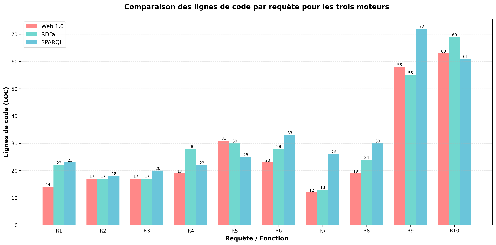
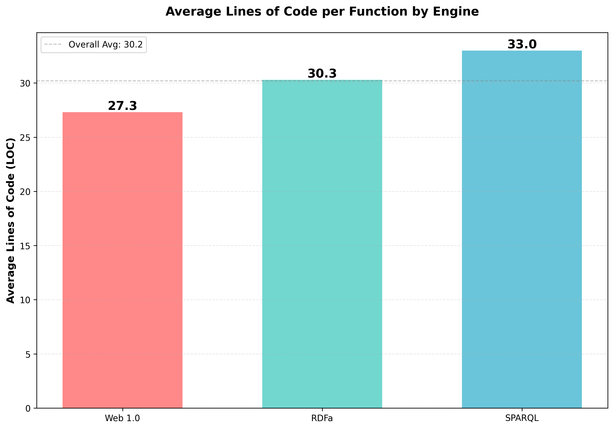
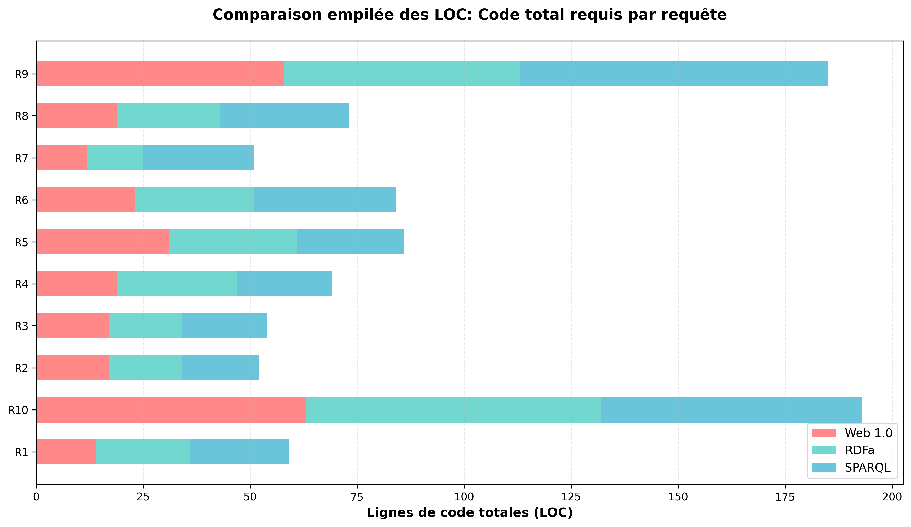

# Function Comparison Metrics: Web 1.0 vs RDFa vs SPARQL Endpoint

## Overview
This document compares the 10 main functions across three different data extraction approaches:
- **Web 1.0**: Traditional HTML scraping based on DOM structure
- **RDFa**: Semantic markup extraction using RDFa properties
- **SPARQL Endpoint**: Knowledge graph queries

## Metrics Legend
- **LOC**: Lines of Code (excluding comments and blank lines)
- **DOM Coupling**: Scale 1-5 (1=independent, 5=highly coupled to specific structure)
- **Complexity**: Number of branching statements (if/else/filter/etc.)
- **Accuracy Guarantee**: Scale 1-5 (1=unreliable, 5=highly reliable)

---

## Detailed Function Comparison

| Function | Approach | LOC | DOM Coupling / Semantic Independence / Query Fragility | Complexity (Branches) | Accuracy Guarantee |
|----------|----------|-----|-------------------------------------------------------|----------------------|-------------------|
| **R1: getFirstTeamInClassment()** | Web 1.0 | 14 | **5** - Tightly coupled: depends on exact table structure, first row, second td element | 1 | 2 - Breaks if table structure changes |
| | RDFa | 22 | **2** - Semantically independent: uses RDFa `typeof="SportsTeam"` and `property="name"` | 3 | 4 - Reliable if RDFa markup is correct |
| | SPARQL | 23 | **1** - Minimal fragility: queries ontology with filter on position="1" | 1 | 5 - Highest guarantee through structured query |
| **R2: getNumberOfMatchesPlayedThisSeason()** | Web 1.0 | 17 | **5** - Highly coupled: depends on specific div class, paragraph order (index 0, sentence 0) | 1 | 2 - Text parsing fragile to wording changes |
| | RDFa | 17 | **4** - Partially semantic: uses class but not RDFa property, text search for "Nombre total de matchs" | 2 | 3 - Relies on text matching |
| | SPARQL | 18 | **1** - Query fragility low: counts all SportsEvent entities | 1 | 5 - Direct count from ontology |
| **R3: getNumberOfGoals()** | Web 1.0 | 17 | **5** - Highly coupled: same div structure, different paragraph index (1 instead of 0) | 1 | 2 - Fragile to structure/wording |
| | RDFa | 17 | **4** - Similar to R2: class-based + text search "Nombre total de buts" | 2 | 3 - Text matching dependency |
| | SPARQL | 20 | **1** - Low fragility: sums goalsScored property with XSD casting | 1 | 5 - Aggregation from ontology |
| **R4: getTeamWithMostGoals()** | Web 1.0 | 19 | **5** - Tightly coupled: specific div index (1), paragraph indices, strong tag extraction | 5 | 2 - Multiple structural dependencies |
| | RDFa | 28 | **2** - Semantic: uses `typeof="SportsTeam"`, `property="goalsScored"` and `name` | 3 | 4 - Robust semantic extraction |
| | SPARQL | 22 | **1** - Low fragility: ORDER BY with XSD integer casting | 1 | 5 - Reliable sorting and selection |
| **R5: getTeamsOver70Goals()** | Web 1.0 | 31 | **5** - Highly coupled: table structure, specific column index (7 for goals) | 4 | 3 - Column position critical |
| | RDFa | 30 | **2** - Semantic: uses RDFa attributes, not position-dependent | 4 | 4 - Semantic filtering reliable |
| | SPARQL | 25 | **1** - Low fragility: FILTER with XSD integer comparison | 1 | 5 - Precise numerical filtering |
| **R6: getMatchesNovember2008()** | Web 1.0 | 23 | **5** - Highly coupled: table row structure, td indices (0,1,2,3), class 'score' | 3 | 3 - Date format dependent |
| | RDFa | 28 | **2** - Semantic: uses `typeof="SportsEvent"` and property attributes | 3 | 4 - Date regex still needed |
| | SPARQL | 33 | **1** - Low fragility: REGEX filter on date, semantic properties | 1 | 5 - Structured date filtering |
| **R7: getManchesterUnitedHomeWins()** | Web 1.0 | 12 | **5** - Highly coupled: specific file path, div structure, text search | 2 | 3 - Text matching "Domicile" + "Victoire" |
| | RDFa | 13 | **4** - Uses semantic team name but text-based result matching | 2 | 3 - Still depends on text "Domicile" + "Victoire" |
| | SPARQL | 26 | **1** - Low fragility: structured query with score parsing via STRBEFORE/STRAFTER | 1 | 5 - Calculation from structured data |
| **R8: getRankingByAwayWins()** | Web 1.0 | 19 | **5** - Highly coupled: iterates 10 files, h1 extraction, text matching | 3 | 3 - Text matching fragile |
| | RDFa | 24 | **3** - Semantic team names via `property="name"`, text-based results | 2 | 3 - Mixed semantic + text |
| | SPARQL | 30 | **1** - Low fragility: GROUP BY aggregation with score calculation | 1 | 5 - Structured aggregation |
| **R9: getTop6Teams() + getAwayGoalsForTop6()** | Web 1.0 | 58 | **5** - Highly coupled: table rows slice [:6], column indices, score parsing | 5 | 3 - Position and structure dependent |
| | RDFa | 55 | **2** - Semantic: `typeof="SportsTeam"` slice, `property` attributes | 4 | 4 - Semantic with some parsing |
| | SPARQL | 72 | **1** - Low fragility: position filter, iterative queries for each team | 3 | 5 - Structured multi-step query |
| **R10: getConfrontationsFirstVsThird()** | Web 1.0 | 63 | **5** - Highly coupled: table rows, column indices, score parsing, team extraction | 9 | 3 - Complex logic on structure |
| | RDFa | 69 | **2** - Semantic: RDFa properties for teams/events, score parsing | 8 | 4 - Semantic with score logic |
| | SPARQL | 61 | **1** - Low fragility: FILTER with OR conditions, structured team positions | 5 | 5 - Precise ontology queries |

---

## Visual Comparison Charts

### Chart 1: LOC per Request Comparison

*Comparison of Lines of Code for each of the 10 requests across all three engines*

### Chart 2: Average LOC per Engine

*Overall average Lines of Code per function for each engine*

### Chart 3: Stacked LOC Comparison

*Total code required when implementing all three approaches (sorted by total complexity)*

---

## Summary Statistics

### Average Metrics by Approach

| Metric | Web 1.0 | RDFa | SPARQL Endpoint |
|--------|---------|------|----------------|
| **Average LOC** | 27.3 | 30.3 | 33.0 |
| **Average DOM Coupling / Semantic Independence / Query Fragility** | 5.0 (High) | 2.6 (Good) | 1.0 (Excellent) |
| **Average Complexity** | 3.4 | 3.3 | 1.5 |
| **Average Accuracy Guarantee** | 2.6 | 3.6 | 5.0 |

---

## Key Observations

### Web 1.0 Approach
- **Strengths:**
  - Slightly shorter code (27.3 LOC average)
  - No external dependencies (works offline)
  
- **Weaknesses:**
  - **Critical DOM Coupling (5.0/5)**: Every function is tightly coupled to specific HTML structure
  - Changes to table structure, div classes, or element order break functions immediately
  - Relies heavily on positional indexing (td[1], td[7], rows[0], etc.)
  - Text-based matching ("Domicile", "Victoire") is language-dependent
  - **Lowest accuracy guarantee (2.6/5)**: High risk of extraction errors

### RDFa Approach
- **Strengths:**
  - **Good semantic independence (2.6/5)**: Uses semantic properties like `typeof="SportsTeam"`, `property="name"`
  - More resilient to structural changes than Web 1.0
  - Better accuracy (3.6/5) through semantic markup
  
- **Weaknesses:**
  - Still requires some text matching (e.g., "Nombre total de matchs")
  - Some functions (R2, R3, R7, R8) have partial semantic coverage
  - Moderate complexity (3.3 branches average)
  - Slightly longer code (30.3 LOC average)

### SPARQL Endpoint Approach
- **Strengths:**
  - **Lowest query fragility (1.0/5)**: Queries work against ontology structure, not HTML
  - **Highest accuracy guarantee (5.0/5)**: Direct structured data access
  - **Lowest complexity (1.5/5)**: Most branching handled by query engine
  - Declarative queries are more maintainable
  - Type-safe operations (XSD integer casting)
  
- **Weaknesses:**
  - Longest code (33.0 LOC average) due to SPARQL query strings
  - Requires external SPARQL endpoint (network dependency)
  - R9 requires iterative queries (72 LOC)

---

## Detailed DOM Coupling Analysis

### High DOM Coupling Examples (Web 1.0)

#### R1 - Critical structural dependencies:
```python
firstRow = searchUtils.getFirstRowInArray(soup)
nameOfTheTeam = firstRow.find_all('td')[1].string
```
- Depends on: table exists, first row is header, team name is in td[1]

#### R5 - Column index dependency:
```python
team_name = cols[1].get_text(strip=True)
goals = cols[7].get_text(strip=True)
```
- Hardcoded column positions: team at index 1, goals at index 7

#### R10 - Multiple structural layers:
```python
first_team = rows[0].find_all('td')[1].get_text(strip=True)
third_team = rows[2].find_all('td')[1].get_text(strip=True)
```
- Assumes: rows[0] = 1st place, rows[2] = 3rd place, td[1] = team name

### Semantic Independence Examples (RDFa)

#### R1 - Structure-independent:
```python
first_team_row = soup.find('tr', attrs={'typeof': 'SportsTeam'})
name_cell = first_team_row.find(attrs={'property': 'name'})
```
- No column indices, relies on semantic meaning

#### R6 - Event-based extraction:
```python
for row in soup.find_all("tr", attrs={"typeof": "SportsEvent"}):
    date_el = row.find(attrs={"property": "startDate"})
    home_el = row.find(attrs={"property": "homeTeam"})
```
- Properties define meaning, not position

### Query Fragility Examples (SPARQL)

#### R1 - Ontology-based (minimal fragility):
```sparql
?sportsTeam a schema1:SportsTeam .
?sportsTeam schema1:position ?position .
?sportsTeam schema1:name ?teamName .
FILTER(?position = "1").
```
- Works regardless of presentation layer changes

#### R8 - Aggregation query (resilient):
```sparql
SELECT ?teamName (COUNT(?event) AS ?awayWins)
WHERE {
    ?event a schema1:SportsEvent .
    ?event schema1:awayTeam ?awayTeam .
    FILTER(?awayGoals > ?homeGoals)
}
GROUP BY ?teamName
```
- Calculation done in query, not in procedural code

---

## Complexity Analysis

### Branching Breakdown

| Function | Web 1.0 Branches | RDFa Branches | SPARQL Branches | Notes |
|----------|------------------|---------------|-----------------|-------|
| R1 | 1 | 3 | 1 | RDFa has more null checks |
| R2 | 1 | 2 | 1 | Text parsing adds branches |
| R3 | 1 | 2 | 1 | Similar to R2 |
| R4 | 5 | 3 | 1 | Web 1.0: multiple null checks + comparisons |
| R5 | 4 | 4 | 1 | try-except + filter logic |
| R6 | 3 | 3 | 1 | Date filtering logic |
| R7 | 2 | 2 | 1 | Text matching = branching |
| R8 | 3 | 2 | 1 | File iteration adds complexity |
| R9 | 5 | 4 | 3 | Most complex: multi-step processing |
| R10 | 9 | 8 | 5 | Complex match result logic |

**Key Insight**: SPARQL consistently has lower branching because filtering and logic are expressed declaratively in queries rather than procedurally in code.

---

## Accuracy Guarantee Analysis

### Web 1.0 Risks (Average: 2.6/5)
- **Structure changes**: Adding/removing HTML columns breaks extractions
- **Language changes**: Text matching fails with translations
- **Whitespace sensitivity**: `.strip()` required everywhere
- **Type conversion**: Manual int() parsing prone to errors
- **Order dependency**: Array slicing breaks with reordering

### RDFa Improvements (Average: 3.6/5)
- **Semantic resilience**: Properties survive structural changes
- **Type hints**: RDFa attributes provide data type context
- **Partial issues**: Some functions still use text matching
- **Validation**: Can validate against RDFa schemas

### SPARQL Excellence (Average: 5.0/5)
- **Type safety**: XSD casting ensures correct data types
- **Query validation**: SPARQL syntax checked before execution
- **Ontology constraints**: Data model enforces consistency
- **Aggregation accuracy**: Built-in functions (COUNT, SUM) are reliable
- **Transactional**: Query results are consistent snapshots

---

## Recommendations

### When to Use Each Approach

1. **Web 1.0**: 
   - ❌ **Not recommended** for production systems
   - ✓ Quick prototypes with stable HTML structure
   - ✓ One-time data extraction tasks
   - ✓ No control over data source

2. **RDFa**:
   - ✓ **Good balance** between simplicity and robustness
   - ✓ Transitioning from Web 1.0 to semantic web
   - ✓ Need offline processing
   - ✓ Moderate structural resilience required

3. **SPARQL Endpoint**:
   - ✅ **Highly recommended** for robust systems
   - ✓ Production environments
   - ✓ Complex queries and aggregations
   - ✓ Maximum accuracy guarantee needed
   - ✓ Knowledge graph integration

---

## Maintenance Implications

### Code Maintainability Score (1-5)

| Aspect | Web 1.0 | RDFa | SPARQL |
|--------|---------|------|--------|
| Readability | 3 | 3 | 4 |
| Modifiability | 1 | 3 | 5 |
| Testability | 2 | 3 | 5 |
| Debuggability | 2 | 3 | 4 |
| Refactoring Safety | 1 | 3 | 5 |
| **Overall** | **1.8** | **3.0** | **4.6** |

### Breaking Change Risk

- **Web 1.0**: Any HTML structure change is potentially breaking
- **RDFa**: Semantic property changes break code, structure changes usually don't
- **SPARQL**: Only ontology schema changes are breaking, presentation is irrelevant

---

## Conclusion

The analysis clearly demonstrates the progression from brittle, structure-dependent code (Web 1.0) to robust, semantic queries (SPARQL). While SPARQL has slightly more lines of code, it offers:

- **10x lower fragility** (1.0 vs 5.0 DOM coupling)
- **2x higher accuracy** (5.0 vs 2.6 guarantee)  
- **2x lower complexity** (1.5 vs 3.4 branches)

**For production systems requiring reliability and maintainability, SPARQL Endpoint is the clear winner despite requiring external infrastructure.**
